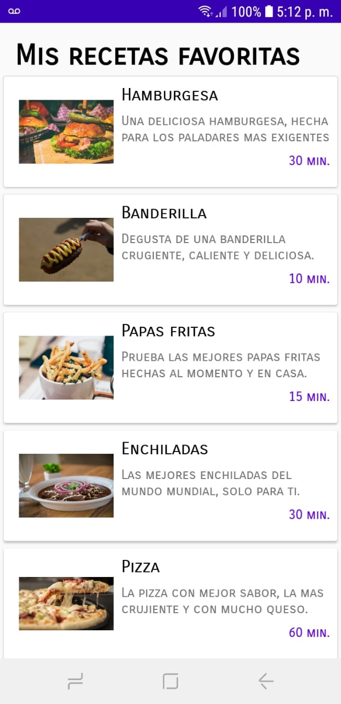
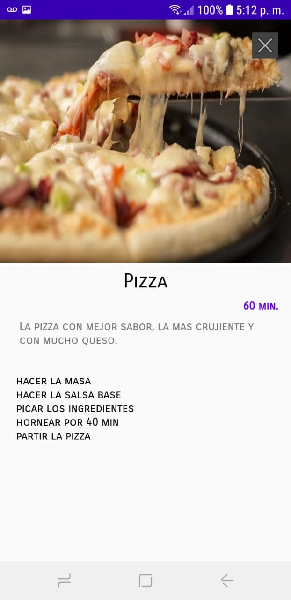

## SimpleRecipe

#####  Android | RecyclerView | CleanCode

In this simple project you can show how to use a recyclerview, and a clean way to get items. I show you how to create a simple 
list of recipes and how to navigate to the detail of this recipe.

